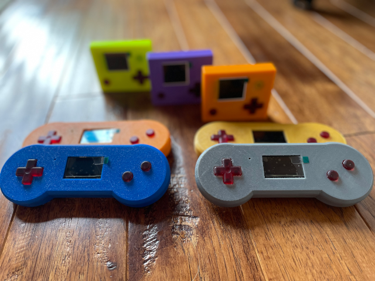

# PicoCat
PicoCat is a Raspberry Pi RP2040 Development Platform

Here are some hats for your PicoCat 
 

Still a work in progress... so not ready for prime time yet : )

<b>Micropython</b>  
  PicoCat : https://micropython.org/download/RPI_PICO/ 
  PicoCatWeb : https://micropython.org/download/RPI_PICO_W/ 
  Thonny IDE: https://thonny.org/ 

<b>CircuitPython</b> <i>( I prefer Micropython myself )</i> 
  PicoCat : https://circuitpython.org/board/raspberry_pi_pico/ 
  PicoCatWeb : https://circuitpython.org/board/raspberry_pi_pico_w/ 
  Mu IDE: https://codewith.mu/ <i>( I recommend Thonny )</i> 

<b>Picomite Basic</b> 
  PicoCat : https://geoffg.net/picomite.html 
  PicoCatWeb : https://geoffg.net/webmite.html 
  PicoCat VGA Hat: https://geoffg.net/picomitevga.html 
  Windows Terminal Program: https://tera-term.en.lo4d.com/windows 
  Linux Terminal Program: https://github.com/tio/tio 
  - tio /dev/ttyACM0 -b 115200 -mODELBS 

<b>Arduino IDE C++</b> 
  File >> Preferences,  In the additional boards manager, add this line 
  https://github.com/earlephilhower/arduino-pico/releases/download/global/package_rp2040_index.json 
  Boards Manager -> install the Raspberry Pi Pico / RP2040 board. 

